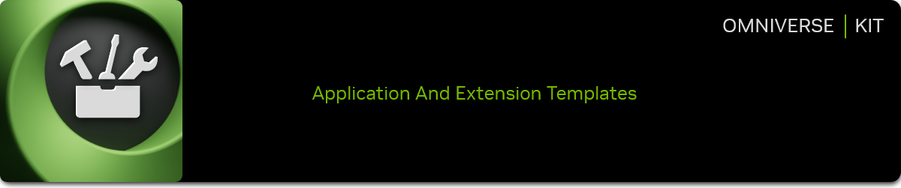
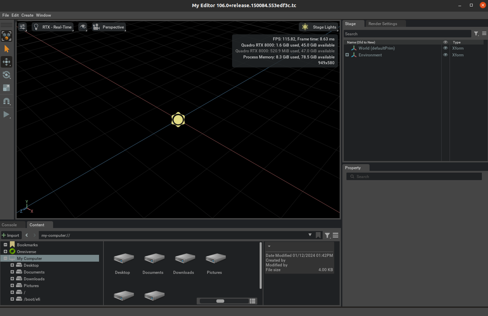

# Omniverse Kit App Template

<p align="center">
  
</p>

## :memo: Feature Branch Information
**This repository is based on a Feature Branch of the Omniverse Kit SDK.** Feature Branches are regularly updated and best suited for testing and prototyping.
For stable, production-oriented development, please use the [Production Branch of the Kit SDK on NVIDIA GPU Cloud (NGC)](https://catalog.ngc.nvidia.com/orgs/nvidia/teams/omniverse/collections/omniverse_enterprise_25h1).

[Omniverse Release Information](https://docs.omniverse.nvidia.com/dev-overview/latest/omniverse-releases.html#)


## Overview

Welcome to `kit-app-template`, a toolkit designed for developers interested in GPU-accelerated application development within the NVIDIA Omniverse ecosystem. This repository offers streamlined tools and templates to simplify creating high-performance, OpenUSD-based desktop or cloud streaming applications using the Omniverse Kit SDK.

### About Omniverse Kit SDK

The Omniverse Kit SDK enables developers to build immersive 3D applications. Key features include:
- **Language Support:** Develop with either Python or C++, offering flexibility for various developer preferences.
- **OpenUSD Foundation:** Utilize the robust Open Universal Scene Description (OpenUSD) for creating, manipulating, and rendering rich 3D content.
- **GPU Acceleration:** Leverage GPU-accelerated capabilities for high-fidelity visualization and simulation.
- **Extensibility:** Create specialized extensions that provide dynamic user interfaces, integrate with various systems, and offer direct control over OpenUSD data, making the Omniverse Kit SDK versatile for numerous applications.

### Applications and Use Cases

The `kit-app-template` repository enables developers to create cross-platform applications (Windows and Linux) optimized for desktop use and cloud streaming. Potential use cases include designing and simulating expansive virtual environments, producing high-quality synthetic data for AI training, and building advanced tools for technical analysis and insights. Whether you're crafting engaging virtual worlds, developing comprehensive analysis tools, or creating simulations, this repository, along with the Kit SDK, provides the foundational components required to begin development.

### A Deeper Understanding

The `kit-app-template` repository is designed to abstract complexity, jumpstarting your development with pre-configured templates, tools, and essential boilerplate. For those seeking a deeper understanding of the application and extension creation process, we have provided the following resources:

#### Companion Tutorial

**[Explore the Kit SDK Companion Tutorial](https://docs.omniverse.nvidia.com/kit/docs/kit-app-template/latest/docs/intro.html)**: This tutorial offers detailed insights into the underlying structure and mechanisms, providing a thorough grasp of both the Kit SDK and the development process.

### New Developers

For a beginner-friendly introduction to application development using the Omniverse Kit SDK, see the NVIDIA DLI course:

#### Beginner Tutorial

**[Developing an Omniverse Kit-Based Application](https://learn.nvidia.com/courses/course-detail?course_id=course-v1:DLI+S-OV-11+V1)**: This course offers an accessible introduction to application development (account and login required).

These resources empower developers at all experience levels to fully utilize the `kit-app-template` repository and the Omniverse Kit SDK.

## Table of Contents
- [Overview](#overview)
- [Prerequisites and Environment Setup](#prerequisites-and-environment-setup)
- [🚀 Quick Start](#-quick-start)
    - [Choose Your Development Style](#choose-your-development-style)
    - [Option A: Visual Development with Kit Playground](#-option-a-visual-development-with-kit-playground-recommended)
    - [Option B: Command Line Development](#️-option-b-command-line-development)
    - [Creating Different Types of Projects](#-creating-different-types-of-projects)
    - [What Gets Created](#-what-gets-created)
    - [Common Workflows](#-common-workflows)
    - [Troubleshooting](#-troubleshooting)
- [Repository Structure](#repository-structure)
    - [Directories Created by Templates](#directories-created-by-templates)
- [Detailed CLI Workflow](#detailed-cli-workflow)
- [Kit Playground - Visual Development Environment](#kit-playground---visual-development-environment)
    - [Getting Started with Kit Playground](#getting-started-with-kit-playground)
    - [Features](#kit-playground-features)
    - [Workflow](#visual-development-workflow)
- [Enhanced Template System](#enhanced-template-system)
    - [Template Organization](#template-organization)
    - [Self-Documentation](#self-documentation)
    - [Template Composition](#template-composition)
    - [Standalone Projects](#standalone-projects)
- [Templates](#templates)
    - [Applications](#applications)
    - [Extensions](#extensions)
    - [Microservices](#microservices)
    - [Components](#components)
- [Tools](#tools)
- [Governing Terms](#governing-terms)
- [Additional Resources](#additional-resources)
- [Contributing](#contributing)

## Prerequisites and Environment Setup

Ensure your system is set up with the following to work with Omniverse Applications and Extensions:

- **Operating System**: Windows 10/11 or Linux (Ubuntu 22.04 or newer)

- **GPU**: NVIDIA RTX capable GPU (RTX 3070 or Better recommended)

- **Driver**: Minimum and recommended - 537.58. Newer versions may work but are not equally validated.

- **Internet Access**: Required for downloading the Omniverse Kit SDK, extensions, and tools.

### Required Software Dependencies

- [**Git**](https://git-scm.com/downloads): For version control and repository management

- [**Git LFS**](https://git-lfs.com/): For managing large files within the repository

- **Python 3.8+**: Required for the template system and build tools.
  - **Required Python packages**: `toml` or `tomli` (for Python < 3.11) - **automatically installed on first run** of `repo.sh` or `repo.bat`, or via `make install-python-deps`

- **(Windows - C++ Only) Microsoft Visual Studio (2019 or 2022)**: You can install the latest version from [Visual Studio Downloads](https://visualstudio.microsoft.com/downloads/). Ensure that the **Desktop development with C++** workload is selected.  [Additional information on Windows development configuration](readme-assets/additional-docs/windows_developer_configuration.md)

- **(Windows - C++ Only) Windows SDK**: Install this alongside MSVC. You can find it as part of the Visual Studio Installer. [Additional information on Windows development configuration](readme-assets/additional-docs/windows_developer_configuration.md)

- **(Linux) build-essentials**: A package that includes `make` and other essential tools for building applications.  For Ubuntu, install with `sudo apt-get install build-essential`

### Recommended Software

- [**(Linux) Docker**](https://docs.docker.com/engine/install/ubuntu/): For containerized development and deployment. **Ensure non-root users have Docker permissions.**

- [**(Linux) NVIDIA Container Toolkit**](https://docs.nvidia.com/datacenter/cloud-native/container-toolkit/latest/install-guide.html): For GPU-accelerated containerized development and deployment. **Installation and Configuring Docker steps are required.**

- [**VSCode**](https://code.visualstudio.com/download) (or your preferred IDE): For code editing and development

## 🚀 Quick Start

Get up and running in minutes! This quick start guide shows you the fastest path to creating your first Omniverse Kit application.

### Choose Your Development Style

You can use either:
- **🎨 Kit Playground** (Visual GUI) - Recommended for beginners
- **⌨️ Command Line** (CLI) - Traditional developer workflow

Both methods produce identical results and can be used interchangeably.

---

### 🎨 Option A: Visual Development with Kit Playground (Recommended)

The fastest way to get started with a visual, browser-based interface:

**1. Clone and Setup:**
```bash
git clone https://github.com/NVIDIA-Omniverse/kit-app-template.git
cd kit-app-template
make install-deps  # Installs Python packages + Node.js for GUI
```

**2. Launch Kit Playground:**
```bash
make playground
```
This opens a visual development environment in your browser at `http://localhost:8001`

For remote access (accessing from another machine):
```bash
make playground REMOTE=1
# Access via: http://your-hostname:8001
```

**3. Create Your First Application:**
- Click **"New Project"** button
- Select a template (e.g., **Kit Base Editor**)
- Fill in project details:
  - **Name:** `my_company.my_first_app` (lowercase, dot-separated)
  - **Display Name:** `My First App` (user-friendly name)
  - **Version:** `1.0.0`
- Click **"Create"** ✨

**4. Build and Run:**
- Click the **Build** button (🔨) in the toolbar
- Wait for build to complete (~2-3 minutes first time)
- Click **Run** (▶️) to launch your application

**5. Start Developing:**
- Edit code in the left pane
- See live preview on the right
- Test on different device sizes
- Console output shows build status

✅ **You now have a working Omniverse Kit application!**

---

### ⌨️ Option B: Command Line Development

For developers who prefer terminal workflows:

**1. Clone and Setup:**
```bash
git clone https://github.com/NVIDIA-Omniverse/kit-app-template.git
cd kit-app-template
```

**2. Create an Application:**

**Linux:**
```bash
./repo.sh template new kit_base_editor \
  --name my_company.my_first_app \
  --display-name "My First App" \
  --version 1.0.0
```

**Windows:**
```powershell
.\repo.bat template new kit_base_editor --name my_company.my_first_app --display-name "My First App" --version 1.0.0
```

> **Note:** First run prompts you to accept Omniverse License Terms.

**3. Build:**
```bash
./repo.sh build      # Linux
.\repo.bat build     # Windows
```

**4. Launch:**
```bash
./repo.sh launch     # Linux
.\repo.bat launch    # Windows
```

✅ **Your application is now running!**

---

### 📦 Creating Different Types of Projects

#### Application Templates

| Template | Command | Use Case |
|----------|---------|----------|
| **Kit Base Editor** | `template new kit_base_editor` | Minimal OpenUSD editor |
| **USD Viewer** | `template new omni_usd_viewer` | Viewport-only for streaming |
| **USD Explorer** | `template new omni_usd_explorer` | Large scene exploration |
| **USD Composer** | `template new omni_usd_composer` | Complex scene authoring |

**Example - Create USD Viewer:**
```bash
./repo.sh template new omni_usd_viewer --name my_company.viewer --display-name "My Viewer" --version 1.0.0
```

#### Extension Templates

| Template | Command | Use Case |
|----------|---------|----------|
| **Python Extension** | `template new basic_python_extension` | Python functionality |
| **Python UI Extension** | `template new basic_python_ui_extension` | Python with custom UI |
| **C++ Extension** | `template new basic_cpp_extension` | High-performance C++ |
| **C++ with Python** | `template new basic_python_binding` | C++ with Python bindings |

**Example - Create Python Extension:**
```bash
./repo.sh template new basic_python_ui_extension \
  --name my_company.my_tool \
  --display-name "My Tool" \
  --version 1.0.0
```

#### Microservice Templates

| Template | Command | Use Case |
|----------|---------|----------|
| **Kit Service** | `template new kit_service` | Headless REST API service |

**Example - Create Microservice:**
```bash
./repo.sh template new kit_service --name my_company.my_api --display-name "My API" --version 1.0.0
```

---

### 🎯 What Gets Created?

When you create a project, the template system automatically generates:

**For Applications:**
```
source/apps/my_company.my_first_app/
├── my_company.my_first_app.kit    # Main configuration
├── README.md                       # Documentation
├── .project-meta.toml             # Project metadata
├── repo.sh / repo.bat             # Wrapper scripts
```

**For Extensions:**
```
source/extensions/my_company.my_tool/
├── config/extension.toml          # Extension config
├── my_company/my_tool/
│   ├── __init__.py                # Entry point
│   └── extension.py               # Main code
├── docs/                          # Documentation
└── data/                          # Assets
```

**Build Artifacts (auto-generated on first build):**
```
_build/
├── linux-x86_64/release/
│   ├── apps/          → symlink to source/apps/
│   ├── exts/          → built extensions
│   └── kit/           → Kit SDK runtime
```

---

### 🔍 Exploring Templates

**List all available templates:**
```bash
./repo.sh template list
```

**Filter by type:**
```bash
./repo.sh template list --type application
./repo.sh template list --type extension
./repo.sh template list --type microservice
```

**View detailed documentation:**
```bash
./repo.sh template docs kit_base_editor
./repo.sh template docs basic_python_ui_extension
```

---

### 💡 Common Workflows

**Working with Multiple Applications:**
```bash
# Create multiple apps
./repo.sh template new kit_base_editor --name my_company.app_one --display-name "App One"
./repo.sh template new omni_usd_viewer --name my_company.app_two --display-name "App Two"

# Build all
./repo.sh build

# Launch specific app
./repo.sh launch --name my_company.app_one
```

**Adding Extensions to Applications:**
```bash
# Create extension
./repo.sh template new basic_python_ui_extension --name my_company.my_tool

# Extension is automatically available to all apps
./repo.sh build
./repo.sh launch
```

**Creating Standalone Projects:**
```bash
# Create self-contained project in any directory
./repo.sh template new kit_base_editor \
  --name my_company.standalone \
  --display-name "Standalone App" \
  --output-dir ~/my-projects/standalone-app

# Build and run independently
cd ~/my-projects/standalone-app
./repo.sh build
./repo.sh launch
```

---

### 🎨 Using Kit Playground Features

Once Kit Playground is running (`make playground`), you can:

**Visual Template Gallery:**
- Browse templates with previews
- Search and filter by category
- View capabilities and connectors
- One-click creation

**Side-by-Side Development:**
- Code editor (left) with syntax highlighting
- Live preview (right) with device modes
- Hot reload - changes appear instantly
- Console output at bottom

**Build & Deploy:**
- One-click build (🔨)
- Run/Stop controls (▶️ ⏹️)
- Export standalone projects
- Deploy to cloud services

**Device Testing:**
- Desktop (1920×1080)
- Tablet (768×1024)
- Phone (375×812)
- 4K/TV (3840×2160)
- Zoom 25% to 200%

---

### ⚡ Tips for Rapid Development

1. **Use Kit Playground for Learning** - Visual feedback helps understand the system
2. **Use CLI for Automation** - Scriptable and CI/CD friendly
3. **Start with Base Editor** - Simplest template to understand
4. **Add Extensions Incrementally** - Build features as separate extensions
5. **Check Template Docs** - Each template has detailed documentation
6. **Test Early, Test Often** - Build and run frequently to catch issues

---

### 🆘 Troubleshooting

**Kit Playground won't start:**
```bash
make install-deps  # Reinstall dependencies
make playground    # Try again
```

**Build fails:**
```bash
./repo.sh build --clean  # Clean build
```

**License prompt on first run:**
```bash
# You must accept license terms on first template creation
# This only happens once per machine
```

**Python dependencies missing:**
```bash
make install-python-deps  # Install just Python packages
```

---

### 📚 Next Steps

Once you've created your first application:

1. **Explore the Code** - Open the generated `.kit` file and extensions
2. **Read Template Docs** - Use `./repo.sh template docs <name>` for details
3. **Build Custom Extensions** - Add your own functionality
4. **Try Different Templates** - Experiment with viewers, composers, services
5. **Deploy Applications** - Package and distribute your creations

**For detailed documentation:**
- [Kit SDK Companion Tutorial](https://docs.omniverse.nvidia.com/kit/docs/kit-app-template/latest/docs/intro.html)
- [Usage and Troubleshooting](readme-assets/additional-docs/usage_and_troubleshooting.md)
- [Omniverse Kit SDK Manual](https://docs.omniverse.nvidia.com/kit/docs/kit-manual/latest/index.html)

---

## Repository Structure

| Directory Item   | Purpose                                                    |
|------------------|------------------------------------------------------------|
| .vscode          | VS Code configuration details and helper tasks             |
| **_build/**      | **Build output directory (generated automatically)**       |
| ├─ **apps/**     | **Symlink to `source/apps/` - applications appear here**   |
| ├─ linux-x86_64/ | **Linux build artifacts and runtime files**                |
| └─ windows-x86_64/| **Windows build artifacts and runtime files**             |
| readme-assets/   | Images and additional repository documentation             |
| **source/**      | **Source code directory (your applications and extensions)**|
| ├─ **apps/**     | **Your application projects (created by templates)**       |
| │  └─ {app_name}/| **Application directory with .kit, README, metadata, scripts** |
| └─ **extensions/**| **Your custom extensions source code**                    |
| templates/       | Enhanced data-driven template system with hierarchical organization |
| ├─ applications/ | Standalone runnable application templates                   |
| ├─ extensions/   | Reusable extension templates organized by language          |
| ├─ microservices/| Headless API service templates                             |
| ├─ components/   | Non-standalone building block templates                     |
| └─ template_registry.toml | Centralized template discovery, organization, and relationship config |
| tools/           | Tooling settings and repository specific (local) tools     |
| ├─ repoman/      | Repository management tools and OS-independent command dispatcher |
| .editorconfig    | [EditorConfig](https://editorconfig.org/) file.            |
| .gitattributes   | Git configuration.                                         |
| .gitignore       | Git configuration.                                         |
| LICENSE          | License for the repo.                                      |
| Makefile         | Build automation for common tasks                          |
| README.md        | Project information.                                       |
| premake5.lua     | Build configuration - such as what apps to build.          |
| repo.bat         | Windows repo tool entry point.                             |
| repo.sh          | Linux repo tool entry point.                               |
| repo.toml        | Top level configuration of repo tools.                     |
| repo_tools.toml  | Setup of local, repository specific tools                  |

### Directories Created by Templates

When you create applications or extensions from templates, the following structure is automatically generated:

**Applications** (created in `source/apps/{app_name}/`):
```
source/apps/my_company.my_editor/
├── my_company.my_editor.kit    # Main application configuration
├── README.md                    # Template-specific documentation
├── .project-meta.toml          # Project metadata (name, version, template)
├── repo.sh                      # Linux wrapper script for commands
└── repo.bat                     # Windows wrapper script for commands
```

**Extensions** (created in `source/extensions/{extension_name}/`):
```
source/extensions/my_company.my_extension/
├── config/
│   └── extension.toml          # Extension configuration
├── docs/                        # Documentation
├── data/                        # Extension data files
├── my_company/
│   └── my_extension/
│       ├── __init__.py         # Python entry point
│       └── extension.py        # Main extension code
└── README.md                   # Extension documentation
```

**Build Artifacts** (automatically created during first build):
```
_build/
├── linux-x86_64/release/
│   ├── apps/                   # Symlink → source/apps/
│   ├── exts/                   # Built extensions
│   ├── extscache/              # Extension cache
│   └── kit/                    # Kit SDK runtime
└── windows-x86_64/release/
    └── ... (same structure for Windows)
```

> **Important:**
> - Applications are created in `source/apps/{name}/` and accessed via symlink at `_build/{platform}/release/apps/`
> - Extensions are created in `source/extensions/{name}/`
> - Build artifacts and Kit SDK runtime are in `_build/{platform}/release/`
> - Each application directory is self-contained with wrapper scripts for running commands

## Detailed CLI Workflow

This section provides in-depth information about the command-line workflow for advanced users and automation scenarios. **For quick start instructions, see [Quick Start](#-quick-start) above.**

> **Architecture Note:** The CLI and Kit Playground are **independent systems**. The CLI is a monolithic application that works standalone without any web server or background services. Kit Playground is an optional browser-based UI that provides a visual development experience. You can use either or both, and they do not interfere with each other.

### Step-by-Step CLI Development Process

#### 1. Clone the Repository

Begin by cloning the `kit-app-template` to your local workspace:

```bash
git clone https://github.com/NVIDIA-Omniverse/kit-app-template.git
cd kit-app-template
```

#### 2. Check and Install Dependencies (Optional)

> **NOTE:** Python dependencies (`toml` package) are automatically installed when you first run `./repo.sh` or `.\repo.bat` commands. This step is optional but recommended to verify your setup.

**Check all dependencies:**
```bash
make deps
```

**Install any missing dependencies:**
```bash
make install-deps
```

This will install:
- Python packages (toml/tomli) required for the template system
- Node.js and npm (if using Kit Playground)

> **TIP:** If you only need to install Python dependencies, run `make install-python-deps`

#### 3. Explore Available Templates

Before creating a new project, explore the available templates:

**List all templates:**
```bash
./repo.sh template list
```

**List templates by type:**
```bash
./repo.sh template list --type application
./repo.sh template list --type extension
./repo.sh template list --type microservice
```

**View template documentation:**
```bash
./repo.sh template docs kit_base_editor
./repo.sh template docs basic_python_ui_extension
./repo.sh template docs kit_service
```

#### 4. Create New Project From Template

Run the following command to create a new project:

**Linux:**
```bash
./repo.sh template new kit_base_editor --name my_company.my_editor --display-name "My Editor" --version 1.0.0
```

**Windows:**
```powershell
.\repo.bat template new kit_base_editor --name my_company.my_editor --display-name "My Editor" --version 1.0.0
```

> **NOTE:** If this is your first time running the `template new` tool, you'll be prompted to accept the Omniverse Licensing Terms.

**What Gets Created:**
- Application files in `source/apps/my_company.my_editor/`
- Main configuration: `my_company.my_editor.kit`
- Project metadata: `.project-meta.toml`
- Wrapper scripts: `repo.sh` and `repo.bat`
- Documentation: `README.md`

#### 5. Build Your Application

Build your new application with the following command:

**Linux:**
```bash
./repo.sh build
```

**Windows:**
```powershell
.\repo.bat build
```

A successful build will result in:
```text
BUILD (RELEASE) SUCCEEDED (Took XX.XX seconds)
```

**What Happens During Build:**
- Kit SDK runtime is downloaded (first time only)
- Extensions are compiled and packaged
- Symlinks created: `_build/{platform}/release/apps` → `source/apps/`
- Build artifacts placed in `_build/{platform}/release/`

If you experience issues related to build, please see the [Usage and Troubleshooting](readme-assets/additional-docs/usage_and_troubleshooting.md) section for additional information.

#### 6. Launch Your Application

Initiate your newly created application using:

**Linux:**
```bash
./repo.sh launch
```

**Windows:**
```powershell
.\repo.bat launch
```

If you have multiple applications, you'll be prompted to select one:
```
? Select with arrow keys which App would you like to launch:
  ▸ my_company.my_editor
    my_company.another_app
```

**Launch specific application directly:**
```bash
./repo.sh launch --name my_company.my_editor
```



> **NOTE:** The initial startup may take 5 to 8 minutes as shaders compile for the first time. After initial shader compilation, startup time will reduce dramatically

### Advanced CLI Usage

#### Interactive Mode (Default)

Without command-line arguments, the template system runs interactively:

```bash
./repo.sh template new
```

This will prompt you for:
- Template type (Application, Extension, Microservice)
- Specific template selection
- Project name and details
- Optional layers and features

#### Non-Interactive Mode (Automation)

For CI/CD pipelines and automation, use command-line arguments:

```bash
./repo.sh template new kit_base_editor \
  --name my_company.automated_app \
  --display-name "Automated App" \
  --version 1.0.0 \
  --accept-license
```

#### Build Configurations

**Release build (default):**
```bash
./repo.sh build --config release
```

**Debug build (with symbols):**
```bash
./repo.sh build --config debug
```

**Clean build (removes cached artifacts):**
```bash
./repo.sh build --clean
```

#### Running from Application Directory

Each application has wrapper scripts that allow running commands from within its directory:

```bash
cd source/apps/my_company.my_editor
./repo.sh build    # Builds from app directory
./repo.sh launch   # Launches this specific app
```

The wrapper scripts automatically find the repository root and execute the appropriate commands.

## Kit Playground - Visual Development Environment

<p align="center">
  
</p>

Kit Playground is a **visual development environment** inspired by Swift Playgrounds that allows you to develop Omniverse Kit applications without touching the command line. It features a side-by-side editor and live preview, visual template gallery, one-click build and deployment, and **real-time command logging**.

> **Important:** Kit Playground is an **optional tool** that provides a browser-based visual interface. It runs a local Flask backend (port 8000) and React frontend (port 8001). When you use `make playground`, it starts these services which run until you stop them (Ctrl+C). **The CLI commands (`./repo.sh`) work completely independently** and do not require the playground server to be running.

### Getting Started with Kit Playground

#### Prerequisites Check

First, check if you have all required dependencies:

```bash
make deps
```

If any dependencies are missing, install them automatically:

```bash
make install-deps
```

This will install:
- Python packages (toml/tomli) required for the template system
- Node.js and npm (required for Kit Playground UI)

#### Installation

**All Platforms:**
```bash
# Install Kit Playground (first time only)
make playground-install

# Launch Kit Playground
make playground
```

**Alternative for Windows (without Make):**
```powershell
# If Make is not available, use the repo.bat wrapper:
.\repo.bat playground-install
.\repo.bat playground
```

The application will open in your default web browser.

#### First Run Setup

On first launch, Kit Playground will:
1. Start the Python backend server automatically
2. Index all available templates
3. Open the visual template gallery

### Kit Playground Features

#### 🎨 Visual Template Gallery
- **Browse** templates with thumbnail previews
- **Search** by name, category, or tags
- **Filter** by type (Application, Extension, Microservice)
- **Preview** template capabilities and connectors
- **One-click install** from the marketplace

#### ✏️ Side-by-Side Development
- **Split View**: Code editor on the left, live preview on the right
- **Monaco Editor**: Full VS Code editing experience
- **Syntax Highlighting**: Python, TypeScript, TOML support
- **IntelliSense**: Auto-completion and suggestions
- **Hot Reload**: Changes appear instantly in preview
- **Real-time Console**: See commands and full output as they execute
  - Displays exact CLI commands (e.g., `$ ./repo.sh build --config release`)
  - Streams build output line-by-line in real-time
  - Color-coded log levels (info, warning, error, success)
  - Filter by source (build, runtime, system)

#### 📱 Device Preview Modes
- Test on **Desktop** (1920×1080)
- Preview on **Tablet** (768×1024)
- Simulate **Phone** (375×812)
- Scale to **4K/TV** (3840×2160)
- **Zoom controls** from 25% to 200%

#### 🔗 Visual Connection System
- **Drag-and-drop** to connect templates
- **Automatic validation** of connector compatibility
- **Bi-directional** and **uni-directional** connections
- **Data source resolution** with guided prompts
- **Dependency visualization** graph

#### 🧹 Project Management
- **Clean All Button**: One-click removal of all user-created projects
  - Executes `make clean-apps` to remove applications and extensions
  - Shows confirmation dialog before deletion
  - Real-time console output showing what's being removed
  - Automatically refreshes project list after cleaning

#### 🚀 Integrated Build & Run
- **One-click build** without leaving the playground
- **Run/Stop** controls in the toolbar
- **Console output** in bottom pane
- **Error highlighting** in the editor
- **Build status** indicators

#### 📦 Deployment Options
- **Export** as standalone project
- **Deploy** to cloud services
- **Package** for distribution
- **Copy** templates for customization

### Visual Development Workflow

1. **Launch Kit Playground**
   ```bash
   make playground
   ```

2. **Browse or Search Templates**
   - Click the gallery icon to browse visually
   - Use the marketplace to discover community templates
   - Search by functionality or use case

3. **Select a Template**
   - Click on any template to load it
   - View its code in the left pane
   - See connector specifications

4. **Edit and Preview Side-by-Side**
   - Code changes on the left
   - Live preview updates on the right
   - Test on different device sizes
   - Use fullscreen for detailed preview

5. **Connect Templates (Optional)**
   - Switch to connection view
   - Drag from output to input connectors
   - Resolve any data requirements
   - View the dependency graph

6. **Build and Run**
   - Click the build button (🔨)
   - Click run to start (▶️)
   - View console output below
   - Stop when done (⏹️)

7. **Deploy Your Application**
   - Click deploy button (☁️)
   - Choose standalone or cloud
   - Follow the deployment wizard
   - Get your packaged application

### Example: Creating a USD Viewer

1. **Open Kit Playground**
2. **Search** for "USD Viewer" in the gallery
3. **Click** to load the template
4. **Customize** the code (optional):
   ```python
   # Modify viewer settings
   viewport.set_camera_position(0, 0, 100)
   viewport.set_lighting_mode("cinematic")
   ```
5. **Click Run** to see your viewer
6. **Test** on different screen sizes
7. **Deploy** as a standalone application

### Kit Playground vs Command Line

| Feature | Kit Playground | Command Line |
|---------|---------------|--------------|
| **Visual Template Gallery** | ✅ Yes | ❌ Text list |
| **Side-by-Side Editing** | ✅ Yes | ❌ Separate windows |
| **Live Preview** | ✅ Built-in | ⚠️ Manual setup |
| **Device Testing** | ✅ One-click | ❌ Manual |
| **Marketplace** | ✅ Integrated | ⚠️ Manual download |
| **Deployment** | ✅ Wizard | ⚠️ Commands |
| **Learning Curve** | ✅ Beginner-friendly | ⚠️ Intermediate |

### Tips for Kit Playground

- **Keyboard Shortcuts**:
  - `Ctrl/Cmd + S`: Save project
  - `Ctrl/Cmd + B`: Build
  - `Ctrl/Cmd + R`: Run
  - `Ctrl/Cmd + .`: Stop
  - `F11`: Fullscreen preview

- **Best Practices**:
  - Start with a template close to your needs
  - Use the console to debug issues
  - Test on multiple device sizes
  - Save projects regularly
  - Use version control for team projects

## Working with Multiple Applications and Standalone Projects

> **Quick Reference:** See [Common Workflows](#-common-workflows) in the Quick Start section for examples.

### Multiple Applications in Repository

By default, `./repo.sh template new` creates application projects in `source/apps/` with each project in its own directory. You can create multiple applications within the same repository:

```bash
# Create first application
./repo.sh template new kit_base_editor --name my_company.app_one --display-name "App One" --version 1.0.0

# Create second application
./repo.sh template new omni_usd_viewer --name my_company.app_two --display-name "App Two" --version 1.0.0
```

**Resulting Structure:**
```
source/apps/
├── my_company.app_one/
│   ├── my_company.app_one.kit
│   ├── README.md
│   ├── .project-meta.toml
│   ├── repo.sh
│   └── repo.bat
└── my_company.app_two/
    ├── my_company.app_two.kit
    ├── README.md
    ├── .project-meta.toml
    ├── repo.sh
    └── repo.bat
```

**Benefits of Multiple Applications:**
- Share extensions across applications
- Common build environment
- Unified dependency management
- Single repository for related projects

**Launch specific application:**
```bash
./repo.sh launch --name my_company.app_one
```

**Run commands from application directory:**
```bash
cd source/apps/my_company.app_one
./repo.sh build   # Builds entire repo
./repo.sh launch  # Launches this specific app
```

### Standalone Projects

For self-contained projects outside the repository, use the `--output-dir` option:

```bash
./repo.sh template new kit_service \
  --name my_company.my_api \
  --display-name "My API Service" \
  --output-dir ~/projects/my-standalone-api
```

**Supported Template Types:**
- ✅ **Applications**: `kit_base_editor`, `omni_usd_viewer`, `omni_usd_explorer`, `omni_usd_composer`
- ✅ **Microservices**: `kit_service`
- ❌ **Extensions**: Not supported (must be part of an application)

**What's Included in Standalone Projects:**
- Complete source code and configuration files
- All necessary build tools (`repo.sh`, `repo.bat`)
- Independent build tooling and dependencies
- Self-contained git repository structure
- Project-specific documentation and metadata
- No dependencies on parent repository

**Building and Running Standalone Projects:**
```bash
cd ~/projects/my-standalone-api
./repo.sh build
./repo.sh launch
```

**When to Use Standalone vs Repository:**

| Scenario | Use Standalone | Use Repository |
|----------|----------------|----------------|
| Single application | ✅ Yes | ✅ Yes |
| Multiple related apps | ❌ No | ✅ Yes (recommended) |
| Shared extensions | ❌ No | ✅ Yes (required) |
| Independent deployment | ✅ Yes | ⚠️ Possible |
| Simple distribution | ✅ Yes | ❌ No |
| Team development | ⚠️ Depends | ✅ Yes (recommended) |

## Enhanced Template System

The Kit App Template features a comprehensive, data-driven template system with self-documentation, composition capabilities, and standalone project generation. The system has been completely redesigned to support template inheritance, configuration validation, and automated documentation.

### Template Organization

Templates are organized by type in a hierarchical structure managed by the `templates/template_registry.toml` configuration:

- **Applications** (`templates/applications/`) - Standalone runnable applications
- **Extensions** (`templates/extensions/`) - Reusable extension components organized by language
- **Microservices** (`templates/microservices/`) - Headless API services
- **Components** (`templates/components/`) - Non-standalone building blocks

Each template includes a comprehensive `template.toml` descriptor with metadata, documentation, variables, dependencies, and inheritance relationships.

### Self-Documentation

All templates are self-documenting with rich metadata and accessible via the command line:

**View specific template documentation:**
```bash
./repo.sh template docs <template_name>
```

**List all templates:**
```bash
./repo.sh template list
```

**List templates by type:**
```bash
./repo.sh template list --type application
./repo.sh template list --type extension
./repo.sh template list --type microservice
./repo.sh template list --type component
```

**Example documentation output:**
```bash
./repo.sh template docs kit_base_editor
# Kit Base Editor
# Type: Application
# Category: Editor
# Version: 1.0.0
#
# ## Overview
# The Kit Base Editor provides a minimal starting point for developers...
#
# ## Use Cases
# - High fidelity OpenUSD editing applications and tools
# - Interactive 3D content manipulation
#
# ## Getting Started
# 1. Run: ./repo.sh template new kit_base_editor --name my_company.my_app
```

### Template Composition

Templates support advanced inheritance and composition patterns managed by the template registry:

- **Inheritance**: Templates can extend base templates using the `extends` field in their `template.toml`
- **Dependencies**: Templates can require other templates as components via the registry's relationship system
- **Composition**: Complex applications can be built from multiple template components
- **Configuration Inheritance**: Variables and settings cascade through the template hierarchy
- **Registry Management**: The `template_registry.toml` file defines template relationships, dependencies, and categories

### Standalone Projects

Generate complete, self-contained projects in any directory:

```bash
./repo.sh template new <template_name> --output-dir /path/to/project
```

Standalone projects include:
- Complete source code and configuration
- All necessary build tools and scripts
- Self-contained `repo.sh` tooling
- Project-specific documentation

## Templates

`kit-app-template` features a comprehensive, data-driven template system with hierarchical organization, self-documentation, composition capabilities, and standalone project generation. The system supports template inheritance, configuration validation, and automated documentation generation.

Use `./repo.sh template list` to see all available templates organized by type, or `./repo.sh template docs <name>` for detailed auto-generated documentation about any template.

### Applications

Standalone runnable applications for various use cases:

- **Kit Base Editor** (`kit_base_editor`): Minimal template for loading, manipulating and rendering OpenUSD content from a graphical interface
- **USD Composer** (`omni_usd_composer`): Template for authoring complex OpenUSD scenes, such as configurators
- **USD Explorer** (`omni_usd_explorer`): Template for exploring and collaborating on large Open USD scenes
- **USD Viewer** (`omni_usd_viewer`): Viewport-only template optimized for streaming and remote interaction

### Extensions

Reusable extension components organized by programming language:

**Python Extensions:**
- **Basic Python** (`basic_python_extension`): Minimal definition of an Omniverse Python Extension
- **Python UI** (`basic_python_ui_extension`): Extension with easily extendable Python-based user interface

**C++ Extensions:**
- **Basic C++** (`basic_cpp_extension`): Minimal definition of an Omniverse C++ Extension
- **C++ w/ Python Bindings** (`basic_python_binding`): C++ Extension with Python interface via Pybind11

### Microservices

Headless API services for automation and cloud deployment:

- **Kit Service** (`kit_service`): Minimal definition of a headless Omniverse Kit SDK service with REST API endpoints

### Components

Non-standalone building blocks that enhance other templates:

**Setup Extensions:**
- Service setup extensions for configuring applications
- Composer, Explorer, and Viewer setup components

**Streaming Layers:**
- Default streaming configuration for web-based access
- NVCF and GDN streaming variants

   **Note for Windows C++ Developers**: C++ templates require `"platform:windows-x86_64".enabled` and `link_host_toolchain` within the `repo.toml` file be set to `true`. For additional C++ configuration information [see here](readme-assets/additional-docs/windows_developer_configuration.md).


## Application Streaming

The Omniverse Platform supports streaming Kit-based applications directly to a web browser. You can either manage your own deployment or use an NVIDIA-managed service:

### Self-Managed
- **Omniverse Kit App Streaming :** A reference implementation on GPU-enabled Kubernetes clusters for complete control over infrastructure and scalability.

### NVIDIA-Managed
- **NVIDIA Cloud Functions (NVCF):** Offloads hardware, streaming, and network complexities for secure, large scale deployments.

- **Graphics Delivery Network (GDN):** Streams high-fidelity 3D content worldwide with just a shared URL.

[Configuring and packaging streaming-ready Kit applications](readme-assets/additional-docs/kit_app_streaming_config.md)


## Tools

The Kit SDK includes a suite of tools to aid in the development, testing, and deployment of your projects. For a more detailed overview of available tooling, see the [Kit SDK Tooling Guide](readme-assets/additional-docs/kit_app_template_tooling_guide.md).

Here's a brief overview of some key tools:

- **Help (`./repo.sh -h` or `.\repo.bat -h`):** Provides a list of available tools and their descriptions.

### Dependency Utilities (New)

- Quick Make targets
  - `make deps-estimate BANDWIDTH=100` — estimate first-time download size/time
  - `make deps-validate VERBOSE=1` — validate `.kit` dependencies (local-only default)
  - `make deps-prefetch CONFIG=release` — pre-fetch all extensions using Kit SDK

- CLI (no install required)
  - `python tools/kit_deps/cli.py estimate --bandwidth 100 --json`
  - `python tools/kit_deps/cli.py validate [-v] [--check-registry]`
  - `python tools/kit_deps/cli.py prefetch [--config release] [-v]`

See `docs/DEPENDENCY_VALIDATION.md` for details.

### Template System

- **Cross-Platform Template Creation (`./repo.sh` or `.\repo.bat template new <name>`):** Generate new projects from templates with data-driven configuration, inheritance support, and variable interpolation. Uses OS-independent Python dispatcher for consistent behavior across Linux and Windows.
- **Enhanced Template Arguments (`./repo.sh template new <name> --name <app_name> --display-name "Display Name"`):** Non-interactive template creation with command-line arguments for automation and CI/CD pipelines.
- **Template Documentation (`./repo.sh template docs <name>`):** View comprehensive self-generated documentation including use cases, features, variables, and examples.
- **Template Discovery (`./repo.sh template list [--type=TYPE]`):** List all available templates with hierarchical organization, optionally filtered by type (application, extension, microservice, component).
- **Standalone Projects (`./repo.sh template new <name> --output-dir <path>`):** Create complete, self-contained projects with independent build tooling and git repository.
- **Template Registry Management:** Centralized template organization via `template_registry.toml` with relationships, dependencies, and categories.

### Development Tools

- **Build (`./repo.sh build` or `.\repo.bat build`):** Compiles your applications and extensions, preparing them for launch.

- **Launch (`./repo.sh launch` or `.\repo.bat launch`):** Starts your compiled application or extension.

- **Testing (`./repo.sh test` or `.\repo.bat test`):** Facilitates the execution of test suites for your extensions, ensuring code quality and functionality. Enhanced test framework support added.

- **Packaging (`./repo.sh package` or `.\repo.bat package`):** Aids in packaging your application for distribution, making it easier to share or deploy in cloud environments.

## Governing Terms
The software and materials are governed by the [NVIDIA Software License Agreement](https://www.nvidia.com/en-us/agreements/enterprise-software/nvidia-software-license-agreement/) and the [Product-Specific Terms for NVIDIA Omniverse](https://www.nvidia.com/en-us/agreements/enterprise-software/product-specific-terms-for-omniverse/).

## Data Collection
The Omniverse Kit SDK collects anonymous usage data to help improve software performance and aid in diagnostic purposes. Rest assured, no personal information such as user email, name or any other field is collected.

To learn more about what data is collected, how we use it and how you can change the data collection setting [see details page](readme-assets/additional-docs/data_collection_and_use.md).


## Additional Resources

- [Kit SDK Companion Tutorial](https://docs.omniverse.nvidia.com/kit/docs/kit-app-template/latest/docs/intro.html)

- [Usage and Troubleshooting](readme-assets/additional-docs/usage_and_troubleshooting.md)

- [Developer Bundle Extensions](readme-assets/additional-docs/developer_bundle_extensions.md)

- [Omniverse Kit SDK Manual](https://docs.omniverse.nvidia.com/kit/docs/kit-manual/latest/index.html)


## Contributing

We provide this source code as-is and are currently not accepting outside contributions.
