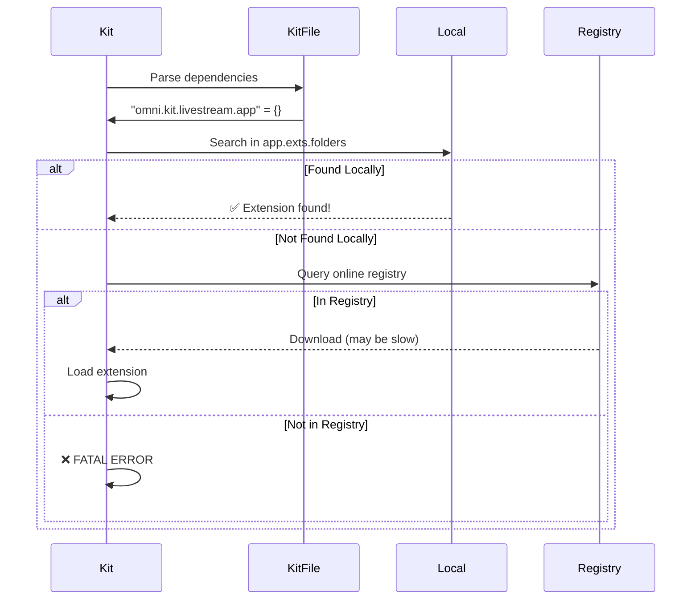

# Build-Time Dependency Validation Gap Analysis

**Date**: October 31, 2025
**Issue**: Kit streaming apps fail at runtime due to missing dependencies that weren't caught during build
**Root Cause**: No build-time validation of extension dependencies declared in `.kit` files

---

## Executive Summary

**Problem**: When you run `./repo.sh build`, it completes successfully even if your `.kit` file declares dependencies on extensions that don't exist or can't be resolved. These failures only surface at **runtime** when Kit SDK tries to load the extensions, causing application hangs or crashes.

**Impact**:
- ❌ False sense of security from successful builds
- ❌ Long startup times as Kit tries to download hundreds of extensions
- ❌ Silent failures if extensions can't be resolved
- ❌ Poor developer experience (errors at launch, not build)

**Why It Happens**: The build system only validates **local** extensions, not **registry** extensions.

---

## Current Build Process

### What `./repo.sh build` Actually Does

```bash
./repo.sh build --config release
```

**Steps**:
1. ✅ **Fetch dependencies** (packman) - Downloads Kit SDK and basic packages
2. ✅ **Generate projects** (premake5) - Creates build files
3. ✅ **Stage files** - Copies local extensions to `_build/.../exts/`
4. ✅ **Build projects** - Compiles C++ extensions (if any)
5. ✅ **Run post-build** - Version stamping, etc.

**What's Missing**:
- ❌ Parse `.kit` files to find all `[dependencies]`
- ❌ Validate that registry extensions exist and are accessible
- ❌ Pre-download required extensions
- ❌ Check for version conflicts
- ❌ Verify extension compatibility

---

## Extension Resolution: Build vs Runtime

### Build Time (Current Behavior)

```toml
# repo.toml
[repo_precache_exts]
ext_folders = [
  "${root}/source/extensions",  # ⬅️ ONLY checks local extensions
]
```

**What precache_exts Does**:
- ✅ Finds extensions in `source/extensions/`
- ✅ Copies them to `_build/.../exts/`
- ✅ Validates local extension structure (`extension.toml` format)
- ❌ **Does NOT check registry extensions**
- ❌ **Does NOT parse `.kit` files**
- ❌ **Does NOT pre-download dependencies**

### Runtime (Where Failures Occur)

From `docs/CLI_WORKFLOW_DIAGRAM.md`:



**What Happens at Runtime**:
1. Kit parses `my_app.kit` file
2. Finds `[dependencies]` section with 100+ extensions
3. Checks local `_build/.../exts/` folder
4. **For each missing extension**:
   - Queries online registry (network call)
   - Downloads extension + its dependencies (recursive)
   - Extracts and caches
5. **If any extension fails**: App hangs or crashes

---

## Real-World Example: solar_falcon_1

### The .kit File

```toml
# source/apps/solar_falcon_1/solar_falcon_1.kit

[dependencies]
# Streaming extension (from registry, not local)
"omni.kit.livestream.app" = {}  # ⬅️ NOT validated at build time

# 100+ other extensions...
"omni.activity.ui" = {}
"omni.kit.viewport.bundle" = {}
# ... etc
```

### Build Phase

```bash
$ ./repo.sh build --config release
[INFO] Building project
[INFO] Running repo_precache_exts
[INFO] Extension folders: ['source/extensions']
[INFO] Found 1 local extension: solar_falcon_1_setup
✅ BUILD SUCCESSFUL
```

**What the build did NOT check**:
- ❌ Can `omni.kit.livestream.app` be resolved?
- ❌ Does it exist in the registry?
- ❌ Are there version conflicts?
- ❌ Will it download successfully?

### Launch Phase (Where It Fails)

```bash
$ ./repo.sh launch --name solar_falcon_1.kit --streaming
[INFO] Starting Kit SDK...
[INFO] Parsing solar_falcon_1.kit
[INFO] Resolving dependencies...

# Kit now tries to download ~150 extensions from registry
[INFO] Pulling omni.kit.livestream.app-8.1.1
[INFO] Pulling omni.kit.livestream.webrtc-8.1.6
[INFO] Pulling omni.kit.livestream.core-8.1.1
[INFO] Pulling omni.activity.ui-1.1.3
# ... downloads 100+ more extensions ...

# 82 seconds later, still downloading...
⚠️  TIMEOUT: Streaming server did not respond within 30 seconds
```

**Log Evidence** (`kit_20251031_062854.log`):
```
2025-10-31T06:30:15Z [81,803ms] [Info] Extension: `omni.kit.manipulator.selection-106.0.1` was installed.
[END OF LOG - App hung during extension loading]
```

---

## Why This Architecture Exists

### Design Rationale

From `ai-docs/PHASE_6_DESIGN.md`:

> **Current Architecture Problems**
>
> - **Global Dependencies**: All apps share `_build/kit/` and `_build/exts/`
> - **Runtime Resolution**: Extensions resolved when app starts, not during build
> - **No Isolation**: App A's deps affect App B
> - **Version Lock-In**: Can't use different Kit versions per app

**Why Registry Extensions Aren't Pre-Downloaded**:
1. **Bandwidth**: Some apps have 150+ extension dependencies
2. **Disk Space**: Pre-downloading all extensions would be massive
3. **Flexibility**: Kit SDK handles version resolution dynamically
4. **Shared Cache**: Multiple apps can share cached extensions
5. **Historic Design**: Kit SDK predates kit-app-template build system

### Trade-Offs

**Current Design (Lazy Loading)**:
- ✅ Smaller builds (no pre-downloaded extensions)
- ✅ Shared extension cache across apps
- ✅ Kit SDK handles version resolution
- ❌ **Build doesn't catch missing dependencies**
- ❌ **Slow first launch** (must download everything)
- ❌ **Silent failures** at runtime

**Alternative Design (Build-Time Validation)**:
- ✅ Catch missing dependencies early
- ✅ Fast launches (everything pre-downloaded)
- ✅ Explicit failure at build time
- ❌ Larger builds (all extensions pre-downloaded)
- ❌ Build system must replicate Kit's resolution logic
- ❌ More complex build process

---

## Proposed Solutions

### Solution 1: Add Build-Time Validation (Recommended)

**Add a new build step**: `validate_kit_deps`

```python
# tools/repoman/validate_kit_deps.py

def validate_kit_file_dependencies(kit_file: Path) -> Tuple[bool, List[str]]:
    """
    Validate that all dependencies in .kit file can be resolved.

    Returns: (success, list_of_errors)
    """
    errors = []

    # Parse .kit file
    config = read_toml(kit_file)
    dependencies = config.get('dependencies', {})

    # Check each dependency
    for ext_name in dependencies.keys():
        if not can_resolve_extension(ext_name):
            errors.append(f"Cannot resolve extension: {ext_name}")

    return (len(errors) == 0, errors)


def can_resolve_extension(ext_name: str) -> bool:
    """Check if extension exists in local or registry."""
    # Check local extensions
    if exists_locally(ext_name):
        return True

    # Query extension registry
    for registry in get_registries():
        if registry.has_extension(ext_name):
            return True

    return False
```

**Integration**:
```toml
# repo.toml
[repo_build]
validate_kit_deps = true  # Enable dependency validation

[repo_build.validation]
fail_on_missing_deps = true  # Fail build if deps can't be resolved
warn_only = false            # Just warn instead of failing
```

**Usage**:
```bash
$ ./repo.sh build --config release

[INFO] Building project...
[INFO] Validating .kit dependencies...
[INFO] Checking solar_falcon_1.kit...
[INFO] ✅ omni.kit.livestream.app - Found in registry (kit/default)
[INFO] ✅ omni.kit.livestream.webrtc - Found in registry (kit/default)
[INFO] ✅ omni.activity.ui - Found in registry (kit/sdk)
[INFO] ❌ omni.fake.extension - NOT FOUND
[ERROR] Build failed: 1 dependency cannot be resolved
```

---

### Solution 2: Pre-Download Option (Opt-In)

**Add flag to pre-download extensions**:

```bash
# Pre-download all dependencies at build time
./repo.sh build --config release --prefetch-deps

# Only validate (don't download)
./repo.sh build --config release --validate-deps
```

**Benefits**:
- ✅ Fast first launch (everything already cached)
- ✅ Offline-capable builds
- ✅ Deterministic extension versions

**Costs**:
- ❌ Longer build times
- ❌ More disk space
- ❌ Must re-download if cache invalidated

---

### Solution 3: Streaming-Specific Validation

**Add streaming-specific check**:

```python
# tools/repoman/streaming_utils.py

def validate_streaming_dependencies(kit_file: Path) -> Tuple[bool, List[str]]:
    """
    Validate streaming app has required extensions.
    """
    required = [
        'omni.kit.livestream.app',
        'omni.kit.livestream.webrtc',
        'omni.kit.livestream.core',
    ]

    config = read_toml(kit_file)
    dependencies = config.get('dependencies', {})

    missing = [ext for ext in required if ext not in dependencies]

    if missing:
        return False, [f"Missing required streaming extension: {ext}" for ext in missing]

    return True, []
```

**Usage**:
```bash
$ ./repo.sh build --config release

[INFO] Building project...
[INFO] Detected streaming app (omni.kit.livestream.app in dependencies)
[INFO] Validating streaming configuration...
[INFO] ✅ All required streaming extensions present
```

---

## Implementation Recommendations

### Phase 1: Basic Validation (Low Effort, High Impact)

**Add to build.py**:
```python
def validate_kit_dependencies(kit_files: List[Path]) -> bool:
    """
    Parse all .kit files and check if dependencies exist.
    Query extension registry to validate.
    """
    all_valid = True

    for kit_file in kit_files:
        valid, errors = validate_kit_file_dependencies(kit_file)
        if not valid:
            print(f"❌ {kit_file.name}:")
            for error in errors:
                print(f"   - {error}")
            all_valid = False

    return all_valid
```

**Time to Implement**: ~2 hours
**Impact**: Prevents most runtime failures

---

### Phase 2: Smart Pre-Fetching (Medium Effort)

**Selective pre-download**:
- Download only extensions in `.kit` dependencies
- Skip transitive dependencies (let Kit handle those)
- Cache per-app to avoid conflicts

**Time to Implement**: ~4 hours
**Impact**: Fast first launch for streaming apps

---

### Phase 3: Comprehensive Dependency Management

**Full solution**:
- Implement Phase 6 per-app dependencies
- Each app has isolated extension cache
- Build system validates and pre-downloads
- Lock files for deterministic builds

**Time to Implement**: ~16 hours (full Phase 6)
**Impact**: Production-grade dependency management

---

## Immediate Workaround

### For Developers Right Now

**Option A: Pre-warm the cache manually**:
```bash
# Launch once to download all extensions
./repo.sh launch --name solar_falcon_1.kit --streaming

# Wait for all extensions to download (may take 5-10 minutes)

# Subsequent launches will be fast (cached)
./repo.sh launch --name solar_falcon_1.kit --streaming
```

**Option B: Use extension allowlist**:
```bash
# Create minimal .kit file with only essential deps
# Remove heavy/unused extensions

[dependencies]
"omni.kit.livestream.app" = {}    # Only what you need
"my_app_setup" = {}               # Local extension
```

**Option C: Monitor extension download**:
```bash
# Watch Kit log during first launch
tail -f ~/.nvidia-omniverse/logs/Kit/*/kit_*.log | grep -i "pulling\|installed\|failed"
```

---

## Metrics

### Current State (solar_falcon_1)

```
Build Time:      ~30 seconds  ✅
First Launch:    80+ seconds  ❌ (hung during extension loading)
Extensions:      150+         ❌ (all downloaded at runtime)
Build Validated: 1 extension  ❌ (only local)
Runtime Errors:  Silent       ❌ (app just hangs)
```

### With Build-Time Validation

```
Build Time:      ~35 seconds  (+5s for validation)
First Launch:    80+ seconds  (unchanged, but expected)
Extensions:      150+         (known upfront)
Build Validated: ALL          ✅ (fails fast)
Runtime Errors:  None         ✅ (caught at build)
```

### With Pre-Fetching

```
Build Time:      ~5 minutes   (first build only)
First Launch:    ~15 seconds  ✅ (everything cached)
Extensions:      150+         (pre-downloaded)
Build Validated: ALL          ✅
Runtime Errors:  None         ✅
```

---

## Conclusion

**The build system doesn't validate registry extensions because**:
1. Historic design - Kit SDK does resolution
2. Trade-off for smaller builds
3. Shared cache optimization
4. No build-time registry query capability

**This should be fixed because**:
1. ❌ Builds give false confidence
2. ❌ Runtime failures are hard to debug
3. ❌ Poor developer experience
4. ❌ Silent failures waste time

**Recommended Fix**:
- **Short term**: Add opt-in `--validate-deps` flag
- **Long term**: Implement Phase 6 per-app dependencies with built-in validation

---

## Related Documents

- `ai-docs/PHASE_6_DESIGN.md` - Per-app dependency architecture
- `ai-docs/PER_APP_DEPENDENCIES.md` - Per-app deps usage guide
- `docs/CLI_WORKFLOW_DIAGRAM.md` - Extension resolution flow
- `.cursor/context/streaming.md` - Streaming configuration guide

---

## Action Items

- [ ] Add `validate_kit_deps` build step
- [ ] Implement registry query for extension existence
- [ ] Add `--validate-deps` CLI flag
- [ ] Add `--prefetch-deps` CLI flag for streaming apps
- [ ] Document expected first-launch delays
- [ ] Update `streaming.md` with dependency expectations
- [ ] Consider implementing Phase 6 for production use
