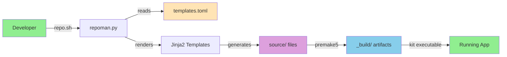
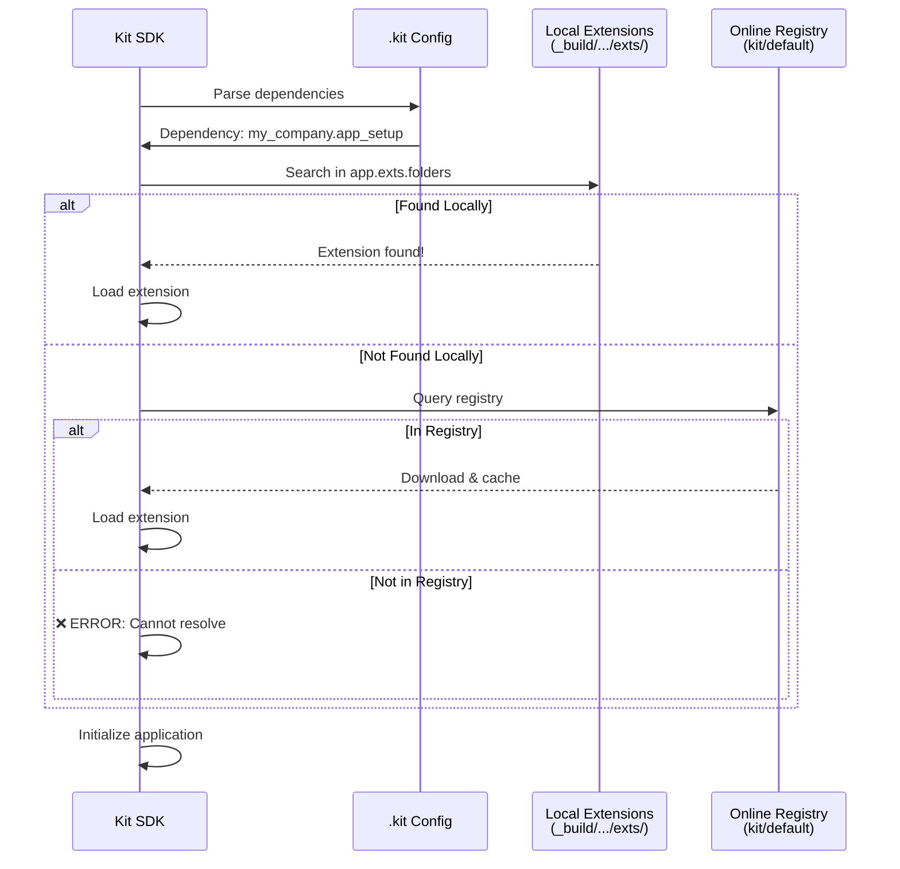

# Kit App Template: CLI Workflow Diagram

This diagram shows the complete workflow from repository clone to running your first application, illustrating all CLI commands and their interactions with the system.

## Complete Workflow: From Clone to First App

```mermaid
flowchart TD
    Start([Developer Starts]) --> Clone[git clone]
    
    Clone --> |Creates| RepoStructure[/Repository Structure\<br/>├── repo.sh/bat<br/>├── tools/repoman/<br/>├── templates/<br/>└── source//]
    
    RepoStructure --> Bootstrap{First-time<br/>setup needed?}
    
    Bootstrap -->|Yes| RepoSetup[./repo.sh build]
    Bootstrap -->|No| TemplateList
    
    RepoSetup --> |Executes| Packman[tools/packman/<br/>bootstrap]
    Packman --> |Downloads| KitSDK[Kit SDK<br/>~2GB download]
    KitSDK --> |Unpacks to| BuildDir[_build/<br/>platform/<br/>release/]
    BuildDir --> TemplateList
    
    TemplateList[./repo.sh template list] --> |Scans| Templates[(templates/<br/>templates.toml)]
    Templates --> |Displays| TemplateTable[Available Templates:<br/>- kit_base_editor<br/>- omni_usd_composer<br/>- omni_usd_explorer<br/>- omni_usd_viewer<br/>- kit_service]
    
    TemplateTable --> SelectTemplate{Developer<br/>chooses template}
    
    SelectTemplate --> CreateCmd["./repo.sh template new TEMPLATE<br/>--name=my_company.my_app<br/>--display-name='My App'<br/>--version=1.0.0"]
    
    CreateCmd --> |Calls| TemplateAPI[tools/repoman/<br/>template_api.py]
    TemplateAPI --> |Reads| TemplateConfig[templates/<br/>TEMPLATE/<br/>template.toml]
    TemplateConfig --> |Has extensions?| CheckExt{Requires<br/>setup extensions?}
    
    CheckExt -->|Yes| CreateSetup[Generate setup<br/>extension template]
    CheckExt -->|No| RenderApp
    
    CreateSetup --> |Renders| SetupExt[source/extensions/<br/>my_company.my_app_setup/<br/>├── config/extension.toml<br/>├── my_company/<br/>│   └── my_app_setup/<br/>│       └── extension.py<br/>└── data/]
    
    SetupExt --> RenderApp[Render app template<br/>with Jinja2]
    
    RenderApp --> |Creates| AppDir[source/apps/<br/>my_company.my_app/<br/>├── my_company.my_app.kit<br/>├── README.md<br/>├── repo.sh<br/>└── repo.bat]
    
    AppDir --> UpdateRepo[Update repo.toml<br/>with new app]
    
    UpdateRepo --> BuildApp["./repo.sh build<br/>--only my_company.my_app"]
    
    BuildApp --> |Executes| Premake[premake5 --file<br/>premake5.lua]
    Premake --> |Generates| BuildFiles[Platform-specific<br/>build files]
    BuildFiles --> |Creates| BuildArtifacts[_build/platform/release/<br/>├── apps/ → source/apps/<br/>├── exts/<br/>│   └── my_company.my_app_setup/<br/>├── kit/<br/>│   └── kit executable<br/>└── my_company.my_app.kit.sh]
    
    BuildArtifacts --> LaunchCmd["./repo.sh launch<br/>--name my_company.my_app.kit"]
    
    LaunchCmd --> |Calls| LaunchPy[tools/repoman/<br/>launch.py]
    LaunchPy --> |Resolves| KitFile[_build/platform/release/<br/>apps/my_company.my_app/<br/>my_company.my_app.kit]
    KitFile --> |Parses| KitConfig[Read .kit file:<br/>- Dependencies<br/>- Settings<br/>- Extension paths]
    
    KitConfig --> CheckXpra{--xpra<br/>flag?}
    
    CheckXpra -->|No| DirectLaunch[Execute:<br/>kit/kit app.kit]
    CheckXpra -->|Yes| XpraBranch
    
    XpraBranch[Start Xpra server<br/>on :100] --> SetDisplay[Set DISPLAY=:100]
    SetDisplay --> XpraExec[Execute:<br/>DISPLAY=:100<br/>kit/kit app.kit]
    
    DirectLaunch --> |Starts| KitRuntime[Kit SDK Runtime]
    XpraExec --> |Starts| KitRuntime
    
    KitRuntime --> LoadExts[Load extensions from:<br/>├── _build/.../exts/<br/>├── ~/.local/share/ov/<br/>└── registry URLs]
    
    LoadExts --> ResolveSetup{Find setup<br/>extension?}
    
    ResolveSetup -->|Not found| ExtError[ERROR: Failed to<br/>resolve extension<br/>dependencies]
    ResolveSetup -->|Found locally| LoadSetup[Load<br/>my_company.my_app_setup<br/>from _build/.../exts/]
    
    LoadSetup --> InitApp[Initialize Application:<br/>- Create UI<br/>- Load settings<br/>- Setup viewport<br/>- Register menus]
    
    InitApp --> Running([Application Running!])
    
    Running --> UserDev{Developer<br/>workflow}
    
    UserDev -->|Edit code| EditCycle["Edit files in<br/>source/extensions/<br/>or source/apps/"]
    UserDev -->|Rebuild| BuildApp
    UserDev -->|Test| LaunchCmd
    UserDev -->|Package| PackageCmd["./repo.sh package<br/>--name my_company.my_app.kit"]
    
    EditCycle --> BuildApp
    
    PackageCmd --> |Executes| PackagePy[tools/repoman/<br/>package.py]
    PackagePy --> |Creates| PackageArtifact[_build/packages/<br/>my_company.my_app-1.0.0.zip<br/>or .tar.gz]
    
    PackageArtifact --> Distribution([Ready for<br/>Distribution])
    
    ExtError -.->|Fix| FixTemplate[Fix template paths:<br/>app.exts.folders<br/>should point to<br/>_build/.../exts/]
    FixTemplate -.-> BuildApp
    
    style Start fill:#90EE90
    style Running fill:#90EE90
    style Distribution fill:#90EE90
    style ExtError fill:#FFB6C1
    style KitSDK fill:#87CEEB
    style Templates fill:#FFE4B5
    style BuildArtifacts fill:#DDA0DD
```



## Command Reference

### 1. Initial Setup
```bash
# Clone repository
git clone https://github.com/NVIDIA-Omniverse/kit-app-template.git
cd kit-app-template

# First-time build (downloads Kit SDK ~2GB)
./repo.sh build
```

### 2. Explore Templates
```bash
# List all available templates
./repo.sh template list

# Show detailed template info
./repo.sh template docs omni_usd_explorer
```

### 3. Create New Project
```bash
# Create from template
./repo.sh template new omni_usd_explorer \
  --name=my_company.my_explorer \
  --display-name="My USD Explorer" \
  --version=1.0.0

# Creates:
# - source/apps/my_company.my_explorer/
# - source/extensions/my_company.my_explorer_setup/
```

### 4. Build Project
```bash
# Build specific app
./repo.sh build --only my_company.my_explorer

# Build all apps
./repo.sh build
```

### 5. Launch Application
```bash
# Standard launch (native display)
./repo.sh launch --name my_company.my_explorer.kit

# Launch with browser preview (requires Xpra)
./repo.sh launch --name my_company.my_explorer.kit --xpra

# Launch with custom display
./repo.sh launch --name my_company.my_explorer.kit --xpra --xpra-display 101
```

### 6. Development Iteration
```bash
# Edit code
code source/extensions/my_company.my_explorer_setup/

# Rebuild and test
./repo.sh build --only my_company.my_explorer
./repo.sh launch --name my_company.my_explorer.kit
```

### 7. Package for Distribution
```bash
# Create distributable package
./repo.sh package --name my_company.my_explorer.kit

# Output: _build/packages/my_company.my_explorer-1.0.0.zip
```

## Key File Paths

### Source Files (Developer Edits)
```
source/
├── apps/
│   └── my_company.my_app/
│       ├── my_company.my_app.kit    # App configuration
│       └── README.md                 # App documentation
└── extensions/
    └── my_company.my_app_setup/
        ├── config/extension.toml     # Extension metadata
        ├── my_company/my_app_setup/
        │   └── extension.py          # Python code
        └── data/                     # Assets (icons, layouts)
```

### Build Artifacts (Auto-generated)
```
_build/
└── linux-x86_64/release/
    ├── apps/                         # Symlink to source/apps/
    ├── exts/
    │   └── my_company.my_app_setup/  # Built extension
    ├── kit/
    │   └── kit                       # Kit SDK executable
    └── my_company.my_app.kit.sh      # Launch script
```

### Templates (Framework)
```
templates/
├── templates.toml                    # Template registry
├── applications/
│   └── usd_explorer/
│       └── template.toml             # Template config
└── extensions/
    └── usd_explorer.setup/
        └── template/                 # Jinja2 templates
            ├── config/extension.toml
            └── {{python_module_path}}/
```

## Data Flow Summary



## Extension Resolution Flow



## Common Issues and Solutions

### Issue 1: Extension Not Found
```bash
# Error: dependency 'my_company.app_setup' can't be satisfied

# Solution: Check extension paths in .kit file
[settings.app.exts.folders]
'++' = [
    "${app}/../../exts",        # ✅ Correct (2 levels up)
    "${app}/../exts",           # ❌ Wrong (only 1 level up)
]
```

### Issue 2: Build Artifacts Missing
```bash
# Solution: Rebuild with clean
./repo.sh build --clean
./repo.sh build --only my_company.my_app
```

### Issue 3: Xpra Not Available
```bash
# Solution: Install Xpra or use native display
sudo apt install xpra  # Linux
# or
./repo.sh launch --name my_app.kit  # Skip --xpra flag
```

## Advanced Workflows

### Multi-App Repository
```bash
# Create multiple apps
./repo.sh template new kit_base_editor --name=my_company.editor
./repo.sh template new omni_usd_viewer --name=my_company.viewer

# Build all
./repo.sh build

# Launch specific app
./repo.sh launch --name my_company.editor.kit
```

### Custom Template Variables
```bash
# Pass additional template variables
./repo.sh template new omni_usd_explorer \
  --name=acme.warehouse_explorer \
  --display-name="ACME Warehouse Explorer" \
  --version=2.1.0
```

### Debugging Build Issues
```bash
# Verbose build output
./repo.sh build --only my_app -v

# Check generated premake files
cat _build/linux-x86_64/release/Makefile

# Inspect extension metadata
cat _build/linux-x86_64/release/exts/my_company.app_setup/config/extension.toml
```

---

**Document Version**: 1.0  
**Last Updated**: October 15, 2025  
**Maintained By**: Kit App Template Team
