# Kit App Template Architecture Diagrams

**Version**: 2.0 (All 6 Phases Complete)
**Last Updated**: October 24, 2025

This document contains comprehensive Mermaid diagrams illustrating the architecture and workflows of the enhanced Kit App Template system.

## Table of Contents

1. [System Overview](#system-overview)
2. [Template Creation Flow](#template-creation-flow)
3. [CLI Architecture](#cli-architecture)
4. [API Architecture](#api-architecture)
5. [Job Management](#job-management)
6. [Per-App Dependencies](#per-app-dependencies)
7. [Standalone Projects](#standalone-projects)
8. [Phase Evolution](#phase-evolution)

---

## System Overview

### High-Level Architecture

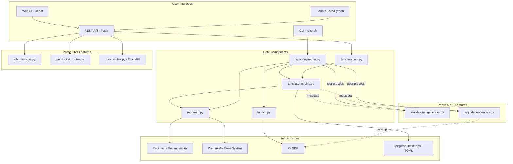

### Component Layers

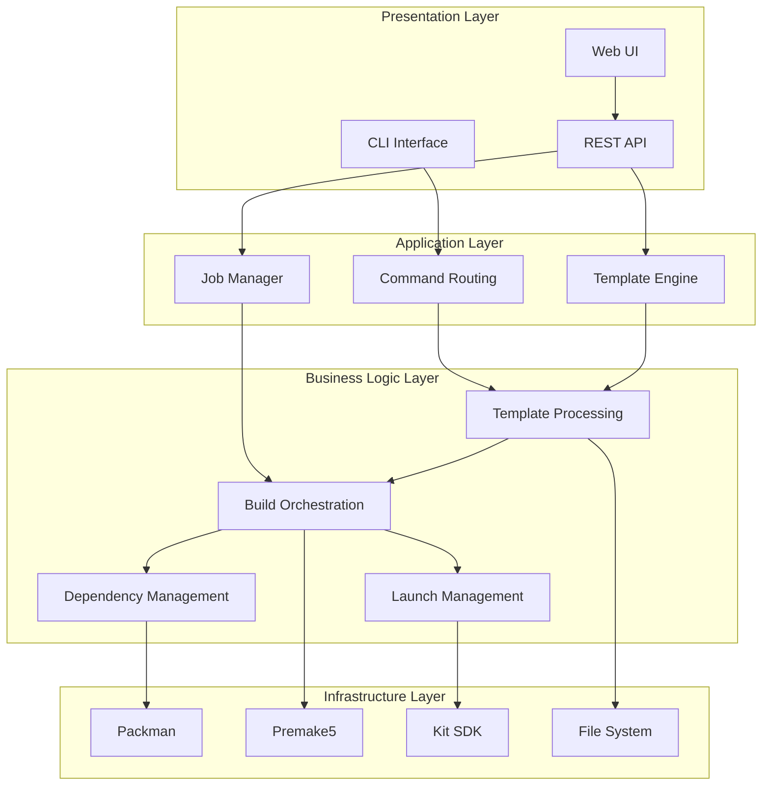

---

## Template Creation Flow

### Standard Template Creation

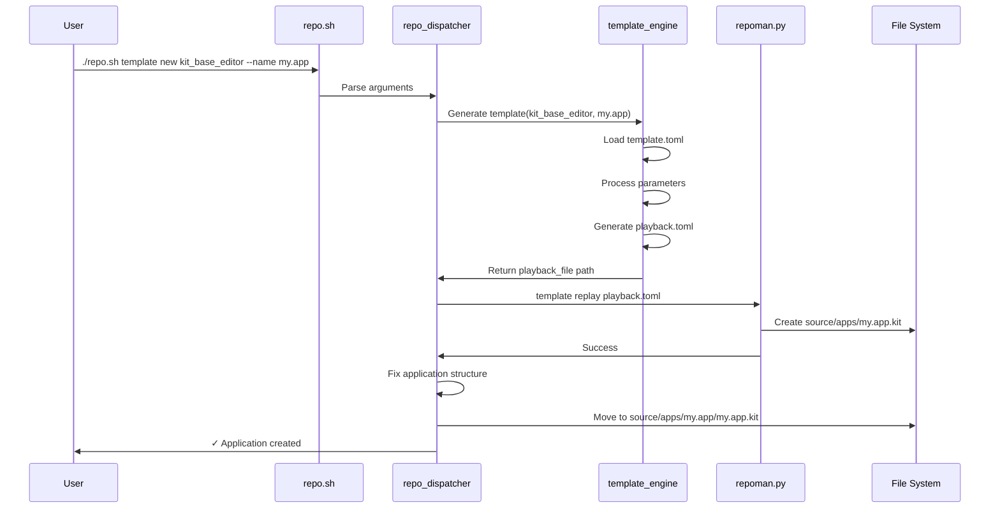

### Template Creation with JSON Mode

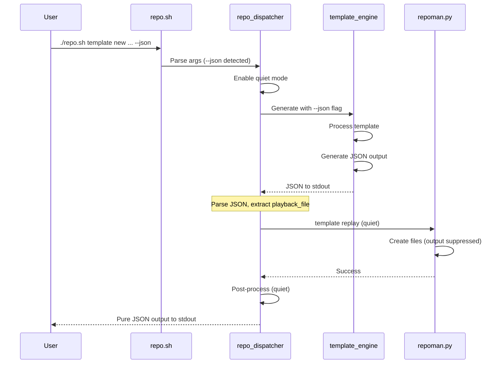

---

## CLI Architecture

### Command Flow

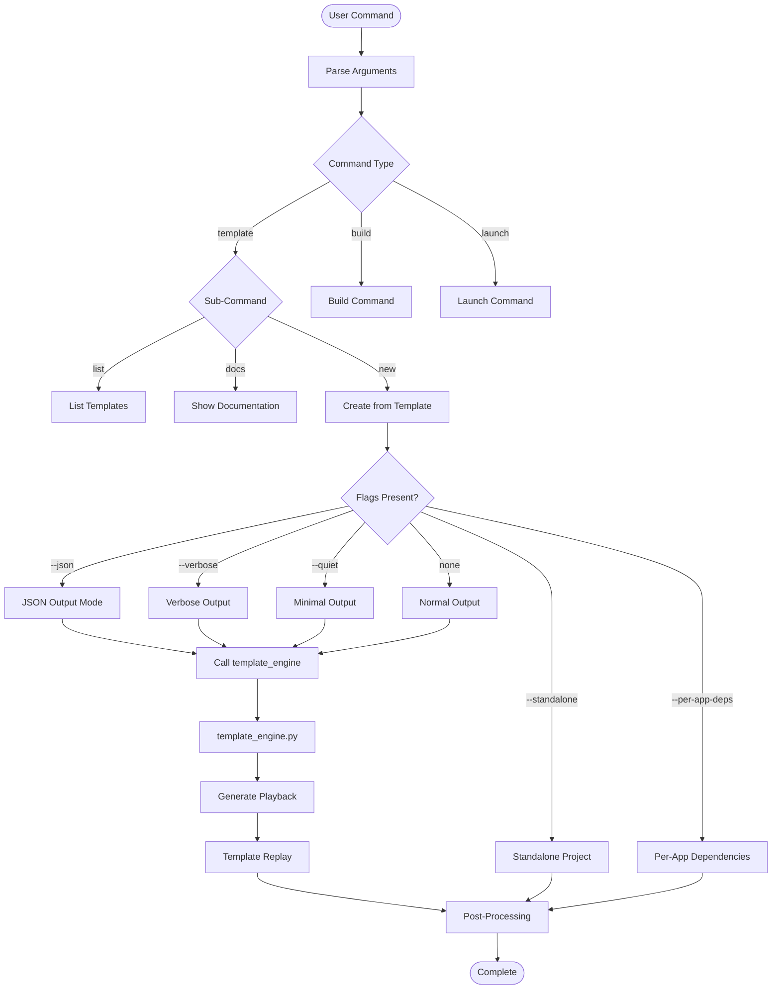

### Flag Processing

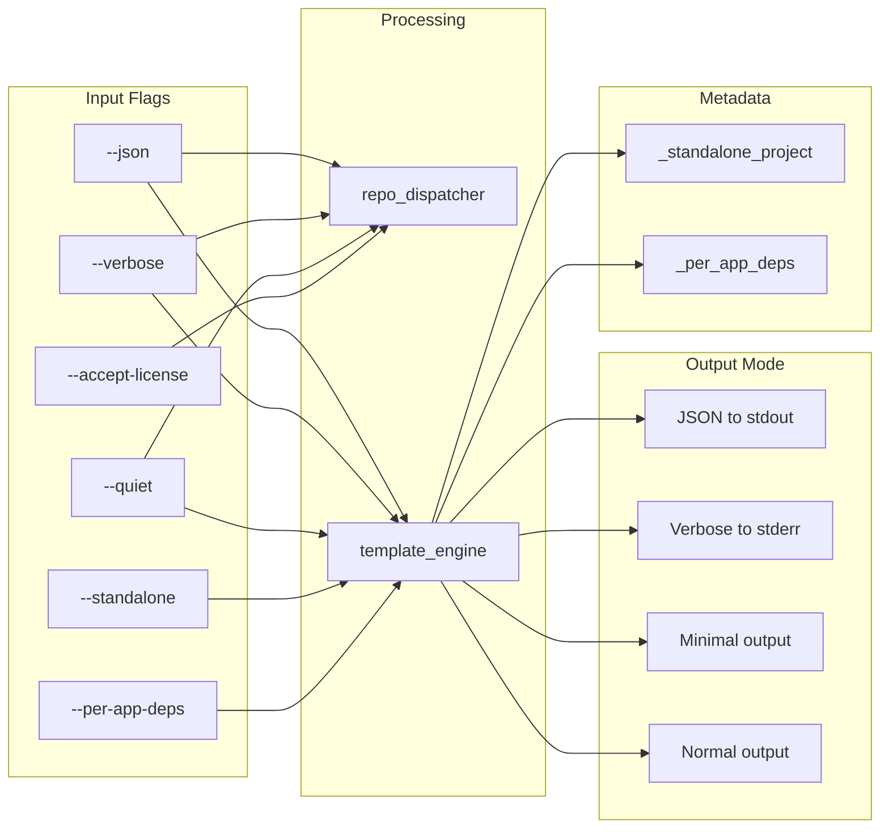

---

## API Architecture

### REST API Structure

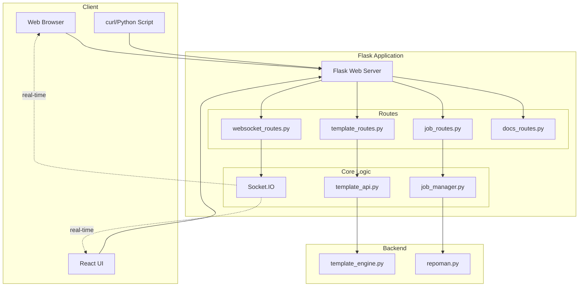

### API Endpoint Organization

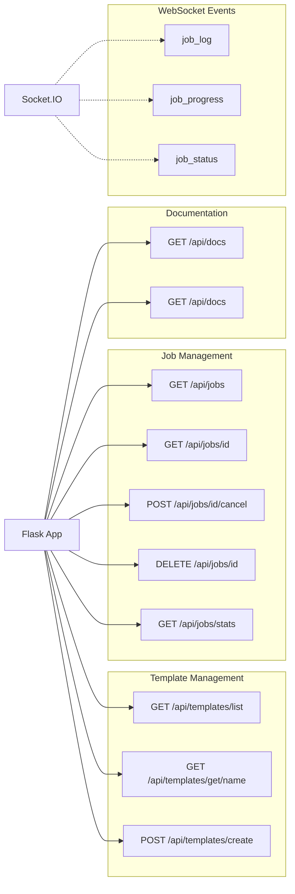

---

## Job Management

### Job Lifecycle

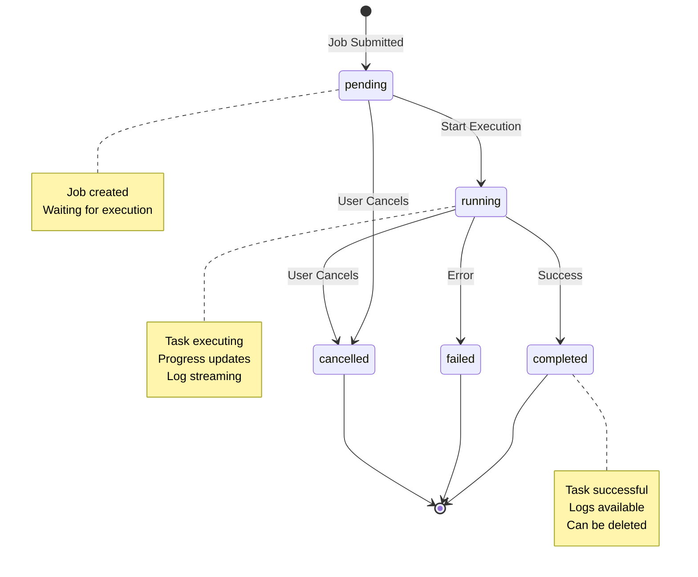

### Job Management Flow

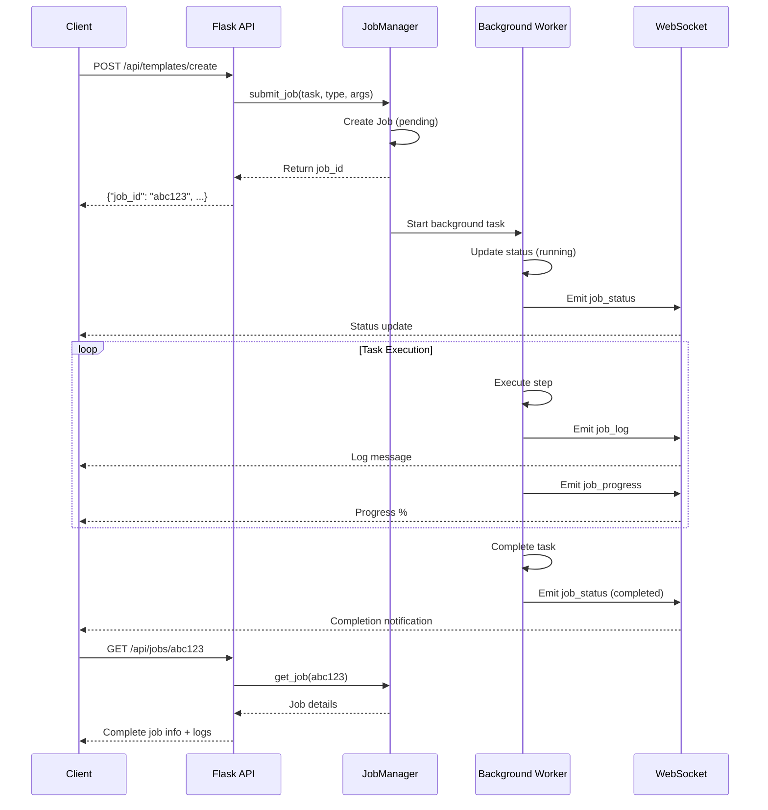

---

## Per-App Dependencies

### Detection and Initialization

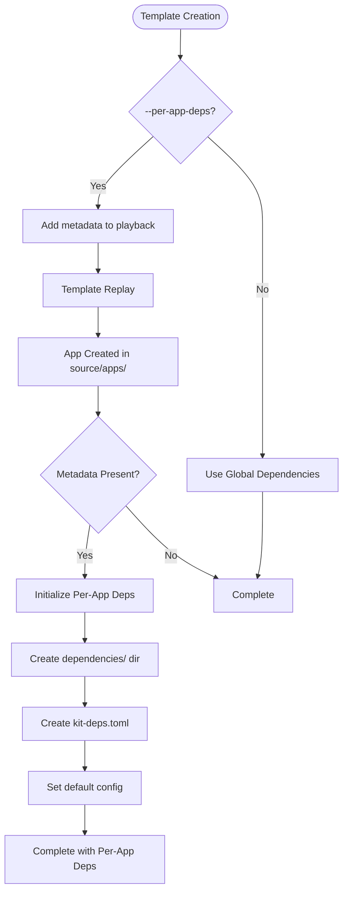

### Launch with Per-App Dependencies

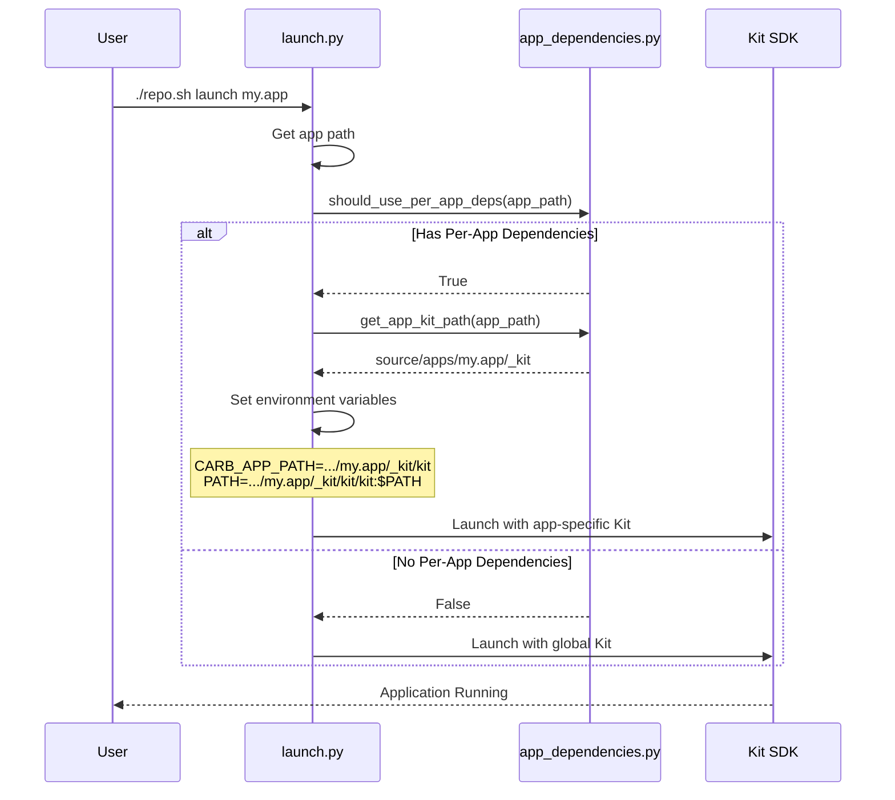

### Directory Structure

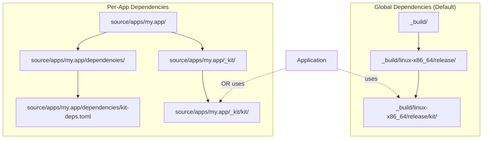

---

## Standalone Projects

### Generation Flow

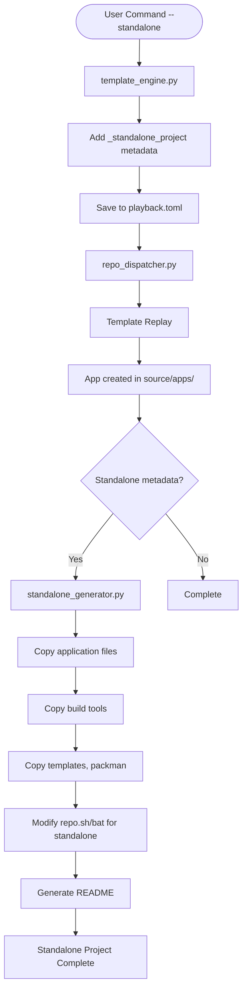

### Standalone Project Structure

```mermaid
graph TD
    Root[Standalone Project Root]

    Root --> R1[repo.sh - modified]
    Root --> R2[repo.bat - modified]
    Root --> R3[README.md - generated]

    Root --> Source[source/]
    Source --> Apps[apps/]
    Apps --> MyApp[my.app/]
    MyApp --> Kit[my.app.kit]

    Root --> Tools[tools/]
    Tools --> Packman[packman/]
    Tools --> Repoman[repoman/ - subset]

    Root --> Templates[templates/]
    Templates --> App Templates[applications/]
    AppTemplates --> KitBase[kit_base_editor/]

    Root --> BuildDir[_build/ - created on first build]
```

---

## Phase Evolution

### System Growth Across Phases

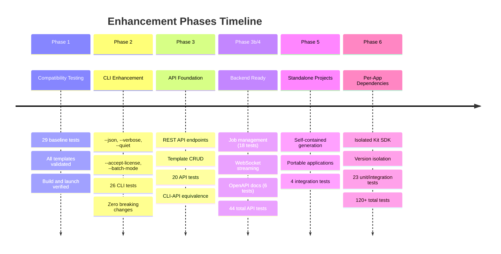

### Feature Dependencies

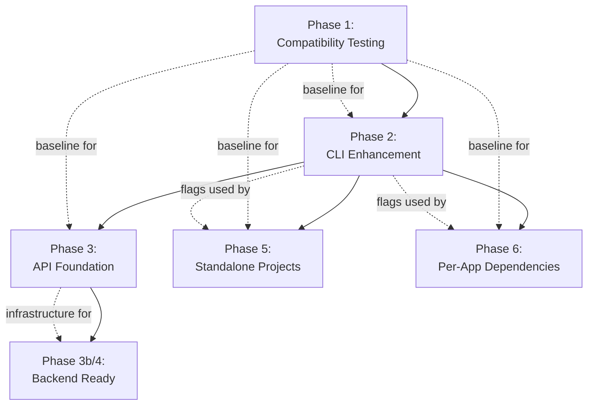

### Component Addition Timeline

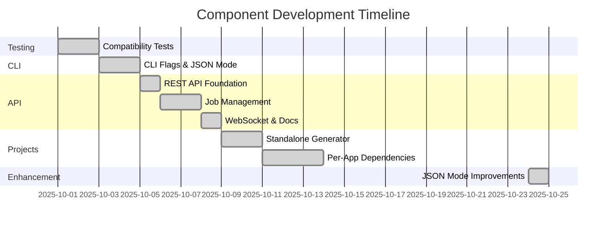

---

## Legend

### Node Types

- **Rectangle**: Process or Component
- **Diamond**: Decision Point
- **Cylinder**: Data Storage
- **Rounded Rectangle**: External System
- **Parallelogram**: Input/Output
- **Circle**: Start/End Point

### Line Types

- **Solid Line** (→): Direct flow or dependency
- **Dotted Line** (⋯→): Optional or conditional flow
- **Dashed Line** (--→): Metadata or configuration

### Colors (when rendered)

- **Blue**: User-facing components
- **Green**: Core processing
- **Yellow**: Infrastructure
- **Purple**: New features (Phase 5/6)
- **Orange**: API/Backend (Phase 3/4)

---

## Viewing Diagrams

These diagrams use **Mermaid** syntax and can be viewed in:

1. **GitHub**: Natively supports Mermaid diagrams
2. **VS Code**: Install "Markdown Preview Mermaid Support" extension
3. **Mermaid Live Editor**: https://mermaid.live/
4. **Documentation Sites**: Most modern static site generators support Mermaid

---

## Additional Resources

- **Architecture Documentation**: [ARCHITECTURE.md](ARCHITECTURE.md)
- **CLI Guide**: [README.md](README.md)
- **API Usage**: [API_USAGE.md](API_USAGE.md)
- **CLI Workflow Diagram**: [CLI_WORKFLOW_DIAGRAM.md](CLI_WORKFLOW_DIAGRAM.md)

---

**For interactive diagram editing, visit**: https://mermaid.live/
